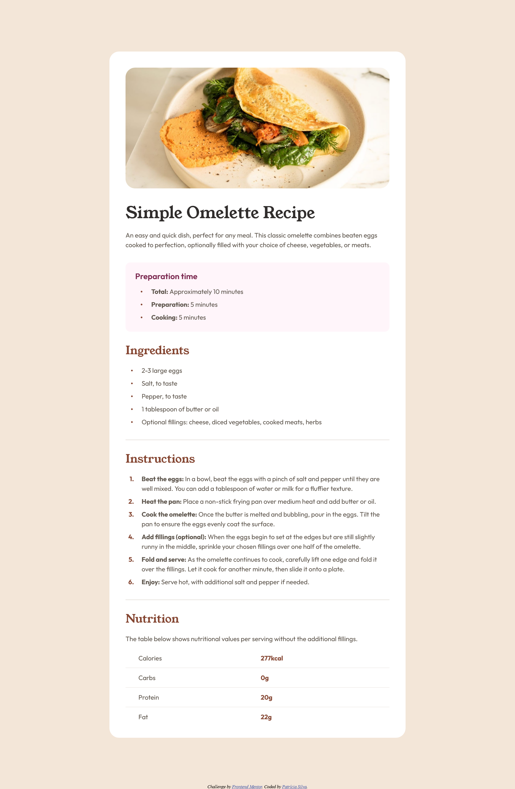

# Frontend Mentor - Recipe page solution

This is a solution to the [Recipe page challenge on Frontend Mentor](https://www.frontendmentor.io/challenges/recipe-page-KiTsR8QQKm). Frontend Mentor challenges help you improve your coding skills by building realistic projects.

## Table of contents

- [Overview](#overview)
  - [Screenshot](#screenshot)
  - [Links](#links)
- [My process](#my-process)
  - [Built with](#built-with)
  - [What I learned](#what-i-learned)
    - [HTML5 semantic elements: `article` vs `section`](#html5-semantic-elements-article-vs-section)
    - [`::marker` CSS pseudo-element](#marker-css-pseudo-element)
    - [`font-variant-numeric` CSS property](#font-variant-numeric-css-property)
    - [List item marker and text alignment](#list-item-marker-and-text-alignment)
    - [`border-collapse` CSS property](#border-collapse-css-property)
- [Useful resources](#useful-resources)
- [Author](#author)

## Overview

### Screenshot



### Links

- [Solution](https://github.com/patriciarrs/Frontend-Mentor-Recipe-Page)
- [Live Site](https://patriciarrs.github.io/Frontend-Mentor-Recipe-Page/)

## My process

### Built with

- Semantic HTML5 markup
- CSS custom properties
- Flexbox
- Mobile-first workflow
- CSS media queries

### What I learned

#### HTML5 semantic elements: `article` vs `section`

I learned the differences between the `article` and `section` elements.

##### `article`

- Self-contained composition intended to be independently distributable or reusable.

- Examples: a forum post, a magazine or newspaper article, a blog entry, a product card, a user-submitted comment, an interactive widget or gadget, or any other independent content item.

- Each `article` should include a heading.

##### `section`

- Generic standalone section of a document, which doesn't have a more specific semantic element to represent it.

- For example, a list of search results or a map display and its controls don't have specific elements, and could be put inside a `section`.

- Alternatives:

- Navigation menu - `nav`.
    - Atomic unit of content that makes sense as a standalone piece - `article`.
    - Useful tangential information that works alongside the main content, but is not directly part of it (like related links, or an author bio) - `aside`.
    - The main content area of a document - `main`.
    - Only using the element as a styling wrapper - `div`.

- Sections should always have a heading, with very few exceptions, for example, a secondary navigation mechanism or some kind of button bar for controlling the app.

---

#### `::marker` CSS pseudo-element

The `::marker` pseudo-element can be used to select the marker box of a list item (typically bullet or number) and change its styling.

```css
::marker {
  font-weight: bold;
}
```

---

#### `font-variant-numeric` CSS property

The `font-variant-numeric` property can be used to control the usage of alternate ordinal markers.

Using the value `proportional-nums` it was possible to match the given design for the ordinal markers.

```css
::marker {
  font-variant-numeric: proportional-nums;
}
```

---

#### List item marker and text alignment

By wrapping the text inside a `li` element with another element, it is possible to match the given design for the text alignment relative to the markers.

The inner element should have `display: inline-block;` and then we can use the `vertical-align` property as needed.

```html
<li>
  <span>Text</span>
</li>
```

```css
span {
  display: inline-block;
  vertical-align: middle;
}
```

---

#### `border-collapse` CSS property

Defining `border-collapse: collapse;` on the `table` element sets the cells inside it to have a shared border.

```css
table {
  border-collapse: collapse;
}
```

### Useful resources

- [\<article>: The Article Contents element](https://developer.mozilla.org/en-US/docs/Web/HTML/Element/article) - This helped me remember the details of usage for the `article` HTML element.
- [\<section>: The Generic Section element](https://developer.mozilla.org/en-US/docs/Web/HTML/Element/section) - This helped me remember the details of usage for the `section` HTML element.
- [font-variant-numeric](https://developer.mozilla.org/en-US/docs/Web/CSS/font-variant-numeric) - This helped me to understand this property.

## Author

- Frontend Mentor - [@patriciarrs](https://www.frontendmentor.io/profile/patriciarrs)
